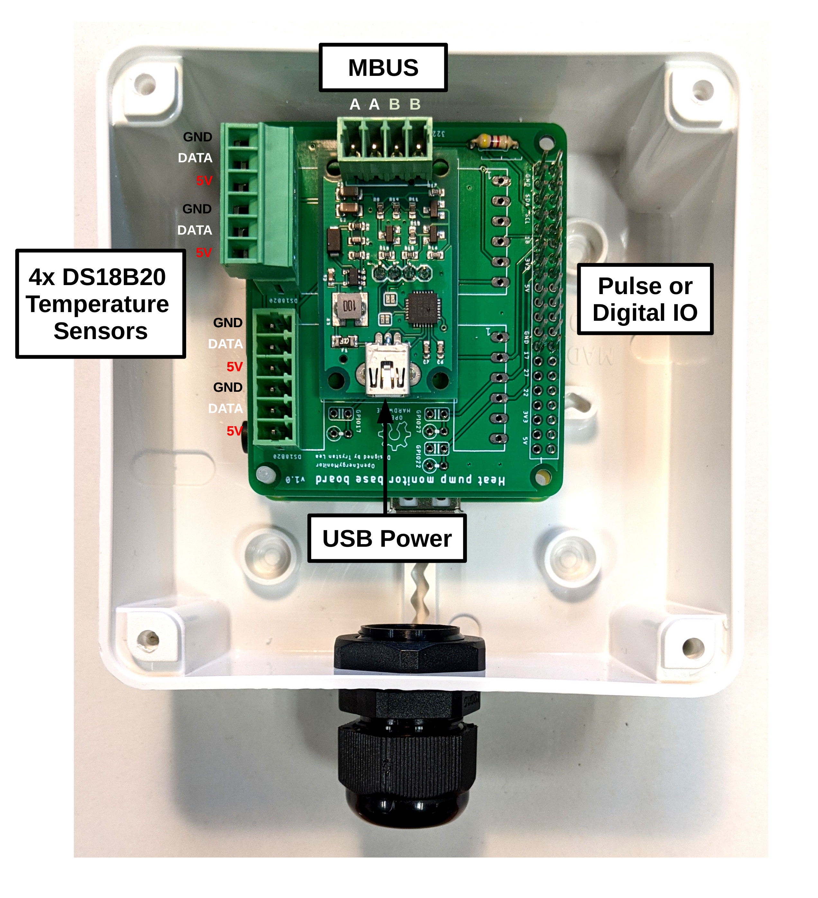

## RaspberryPi & MBUS based heat pump monitor

This is a new heat pump monitor board designed specifically for interfacing with MID standard electricity and heat meters via MBUS. It has a RaspberryPi at it’s core running our emonSD image enabling local or/and remote logging and data visualisation.

It is designed for monitoring heat pump electricity consumption, heat output and system temperatures for detailed performance analysis & troubleshooting.

### Features

- MBUS Reader (Reads from connected electricity and heat meters)
- DS18B20 Temperature sensor connections
- 6 Digital input or outputs can be used for pulse counting
- I2C connection (uses 2 of the 6 digital IO's)
- RaspberryPi running the OpenEnergyMonitor emonSD image

### Connection diagram



### Setup

The following setup instructions assume an assembled heat pump monitor kit as shown in the picture above, with pre-prepared SD card running the standard emonSD image inserted into the RaspberryPi **(with SSH enabled, see [Guide: Credentials](https://guide.openenergymonitor.org/technical/credentials/))**.

1. Use the connection diagram above to connect MBUS meters, temperature sensors and power. There are two A and B MBUS terminals that can be used to simplify connecting two meters to the MBUS reader. Make sure that the power supply is capable of supplying 2A e.g [OpenEnergyMonitor Shop 5V USB Power Adapter](https://shop.openenergymonitor.com/5v-dc-usb-power-adapter-uk-plug) (MBUS data corruption can occur if the power supply output is too low).

2. Power up the unit, wait a couple of minutes for the Pi to create a WiFi access point. Connect to the access point and then use the WiFi configuration interface to connect the unit to your home WiFi. See [Guide: Connect](https://guide.openenergymonitor.org/setup/connect/) for full details.


---

**Example test setup:** Reading from a SDM120-MBUS electricity meter and a Qalcosonic E3 heat meter. These, or similar meters would usually be installed as part of heat pump installation.


**The heat pump monitor:** This design combines a: RaspberryPi + [heat pump monitoring baseboard](baseboard) + [USB to MBUS reader](../USB_MBUS_Reader) board in a single unit.


---

**Forum post: Reading from multiple MBUS meters with the EmonHub MBUS interfacer**<br>
https://community.openenergymonitor.org/t/reading-from-multiple-mbus-meters-with-the-emonhub-mbus-interfacer/18159

### Example EmonHub Configuration

The following is a full */etc/emonhub/emonhub.conf* example that reads from any connected DS18B20 temperature sensors, an SDM120-MBUS electricity meter and a Qalcosonic E3 heat meter. Data is forwarded to the local emoncms installation using MQTT and the remote emoncms installation via HTTP.

```
[hub]
loglevel = DEBUG

[interfacers]

[[DS18B20]]
    Type = EmonHubDS18B20Interfacer
    [[[init_settings]]]
    [[[runtimesettings]]]
        pubchannels = ToEmonCMS,
        read_interval = 10
        nodename = temperatures

[[MBUS]]
    Type = EmonHubMBUSInterfacer
    [[[init_settings]]]
        device = /dev/ttyAMA0
        baud = 2400
    [[[runtimesettings]]]
        pubchannels = ToEmonCMS,
        read_interval = 10
        validate_checksum = False
        nodename = mbus
        [[[[meters]]]]
            [[[[[sdm120]]]]]
               address = 1
               type = sdm120
            [[[[[qalcosonic]]]]]
                address = 2
                type = qalcosonic_e3


[[MQTT]]
    Type = EmonHubMqttInterfacer
    [[[init_settings]]]
        mqtt_host = 127.0.0.1
        mqtt_port = 1883
        mqtt_user = emonpi
        mqtt_passwd = emonpimqtt2016

    [[[runtimesettings]]]
        pubchannels = ToRFM12,
        subchannels = ToEmonCMS,
        nodevar_format_enable = 1
        nodevar_format_basetopic = emon/

[[emoncmsorg]]
    Type = EmonHubEmoncmsHTTPInterfacer
    [[[init_settings]]]
    [[[runtimesettings]]]
        pubchannels = ToRFM12,
        subchannels = ToEmonCMS,
        url = https://emoncms.org
        apikey = xxxxxxxxxxxxxxxxxxxxxxxxxxxxxxxx
        senddata = 1
        sendstatus = 1
        sendinterval= 30

[nodes]
```
