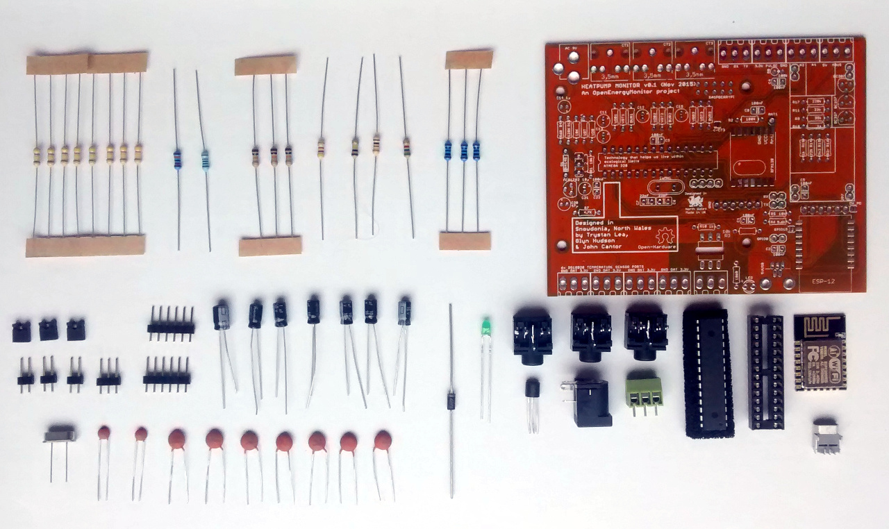
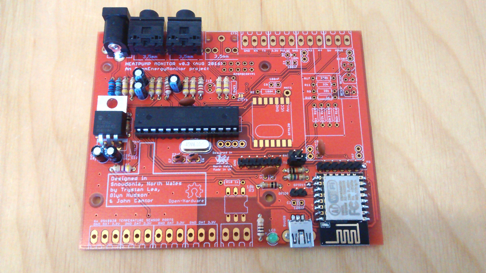

# Energy Monitor Build

A cut down version of the heatpump monitor can be used as a WIFI energy monitor without the additional components used for the MBUS reader, RFM69 and other connectors.

BOM:

**Resistor reference**

The following resistors are included in the kit.

<table cellspacing="0" border="0">
	<colgroup width="63"></colgroup>
	<colgroup width="219"></colgroup>
	<colgroup width="162"></colgroup>
	<colgroup width="245"></colgroup>
	<tr>
		<td height="17" align="center"><b>Quantity</b></td>
		<td align="left"><b>Resistance</b></td>
		<td align="left"><b>Colour code</b></td>
		<td align="left"><b>Function</b></td>
	</tr>
	<tr>
		<td height="17" align="center" sdval="8" sdnum="2057;">8</td>
		<td align="left">470k (5%)</td>
		<td align="left">Yellow-purple-yellow</td>
		<td align="left">CT + ACAC Voltage dividers</td>
	</tr>
	<tr>
		<td height="17" align="center" sdval="1" sdnum="2057;">1</td>
		<td align="left">120k (blue, 1%)</td>
		<td align="left">Brown-red-black-orange</td>
		<td align="left">ACAC voltage divider top</td>
	</tr>
	<tr>
		<td height="17" align="center" sdval="1" sdnum="2057;">1</td>
		<td align="left">10k (blue, 1%)</td>
		<td align="left">Brown-black-black-red</td>
		<td align="left">ACAC voltage divider bottom</td>
	</tr>
	<tr>
		<td height="17" align="center" sdval="1" sdnum="2057;">3</td>
		<td align="left">10k (5%)</td>
		<td align="left">Brown-black-orange</td>
		<td align="left">Mixed use</td>
	</tr>
	<tr>
		<td height="17" align="center" sdval="1" sdnum="2057;">1</td>
		<td align="left">4.7k (5%)</td>
		<td align="left">Yellow-purple-red</td>
		<td align="left">DS18B20 Temperature sensing</td>
	</tr>
	<tr>
		<td height="17" align="center" sdval="1" sdnum="2057;">1</td>
		<td align="left">100k (5%)</td>
		<td align="left">Brown-black-yellow</td>
		<td align="left">Pulse counting dropdown</td>
	</tr>
	<tr>
		<td height="17" align="center" sdval="1" sdnum="2057;">1</td>
		<td align="left">100R (5%)</td>
		<td align="left">Brown-black-brown</td>
		<td align="left">LED current limiting resistor</td>
	</tr>
	<tr>
		<td height="17" align="center" sdval="1" sdnum="2057;">1</td>
		<td align="left">5.6k (5%)</td>
		<td align="left">Green-blue-red</td>
		<td align="left">Serial 5V to 3.3V level converter</td>
	</tr>
	<tr>
		<td height="17" align="center" sdval="3" sdnum="2057;">3</td>
		<td align="left">CT burden resistors (1%)</td>
		<td align="left">see note</td>
		<td align="left"> </td>
	</tr>
</table>

Component values including resistor resistance and capacitor capacitance are printed on the PCB. See resistor color code graphic here to match the resistors [images/resistor-color-chart.jpg](images/resistor-color-chart.jpg).

Several of the resistors only have a reference name printed, the following are all part of the CT sensor and ACAC sensor biasing circuits and are all 470k resistors (470k (yellow-purple-yellow) was historically choosen to increase battery lifespan in battery powered nodes - lower values down to around 10k could be choosen instead here for a more stable biasing voltage):

    VDT: Voltage Divider Top (for AC-AC Voltage sensor)
    VDB: Voltage Divider Bottom (for AC-AC Voltage sensor)
    VDT1: Voltage Divider Top 1 (for CT sensor 1)
    VDB1: Voltage Divider Bottom 1 (for CT sensor 1)
    VDT2: Voltage Divider Top 2 (for CT sensor 2)
    VDB2: Voltage Divider Bottom 2 (for CT sensor 2)
    VDT3: Voltage Divider Top 3 (for CT sensor 3)
    VDB3: Voltage Divider Bottom 3 (for CT sensor 3)

**CT Burden resistors:**

The included burden resistor is 100 Ohms, this provides a AC power measurement range of **0 - 5.4 kW**. A smaller burden resistor can be used instead for larger measurement range at lower resolution, 22 Ohms would provide 0 - 24 kW range. See Building Blocks guide [CT sensors - interfacing with arduino](https://openenergymonitor.org/emon/buildingblocks/ct-sensors-interface)

Example calculation:

    Max Power = (((VREF ÷ 2) ÷ Burden resistance) × CT turns) × 230V ÷ sqrt(2)
    Max Power = (((3.3V ÷ 2) ÷ 100R) × 2000 turns) × 230V ÷ sqrt(2) 
    Copy into calculator: (((3.3÷2)÷100)×2000)×230÷sqrt(2) 

Burden resistor PCB name reference:

    BUR1: Burden resistor 1 (for CT sensor 1)
    BUR2: Burden resistor 2 (for CT sensor 2)
    BUR3: Burden resistor 3 (for CT sensor 3)
    
Capacitors: C11, C13, C12, C19 all 10uF

The following image can also be used as a reference of component locations. 
    

**Voltage regulator note:**The voltage regulator shown in the picture above is the large through-hole TC1262-3.3V, the board also supports the smaller MCP1825 surface mount voltage regulator. 

**Tip 1:** It is usually easier to start by soldering the lower profile components first such as the resistors and to build up to the taller components. 

**Tip 2:** Test that the ATmega328 part works first before soldering in the ESP8266 module so that any issues with the ATmega328 part can be isolated before adding the ESP WIFI part. 

Check that the power supply voltages are all as expected before inserting the ATmega328 in the 28pin holder.

**ESP8266 Supply capacitor:** An additional 10uF is required across the supply to the ESP8266 module. The ground is top-left and 3.3v top-right.

**ESP CH_PD and GPIO15 Solder jumpers** Both of these solder jumpers need to be connected with a small blob of solder for the ESP module to work.

### Uploading the ATmega328 Firmware

The energy monitor only firmware can be found here: [https://github.com/openenergymonitor/HeatpumpMonitor/tree/master/HeatpumpMonitorTH/Firmware/Arduino/BasicEnergyMonitor](https://github.com/openenergymonitor/HeatpumpMonitor/tree/master/HeatpumpMonitorTH/Firmware/Arduino/BasicEnergyMonitor)

Use a USB to UART programmer connected to the 6-way UART header closest to the ATmega328 to upload this firmware using the Arduino IDE. There's a guide on uploading Arduino firmware here: [http://openenergymonitor.org/emon/buildingblocks/setting-up-the-arduino-environment](http://openenergymonitor.org/emon/buildingblocks/setting-up-the-arduino-environment)

### Uploading the ESP8266 Firmware: EmonESP

The EmonESP ESP8266 Firmware and upload guide can be found here: [https://github.com/openenergymonitor/EmonESP](https://github.com/openenergymonitor/EmonESP)

**GPIO0 Jumper:** Place a jumper across the GPIO0 header just left of the ESP8266 module to place the ESP8266 module in bootloader mode. Power cycle the board to reset the ESP8266 module. Once the firmware is uploaded remove the GPIO0 jumper so that the ESP8266 starts up without going into bootloader mode at the next power cycle.
