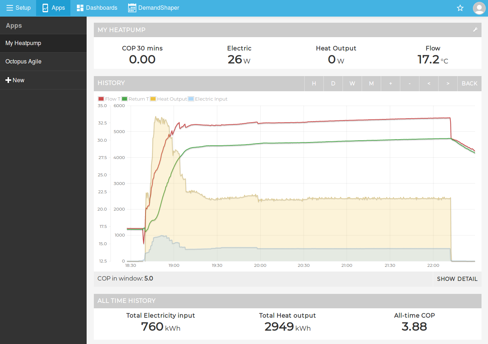

# Heatpump Monitor

This is a technical github repository for OpenEnergyMonitor open hardware and software heat-pump performance monitoring development.

## Rationale

Heat-pumps are a key component of zero carbon energy systems making it possible to provide heating efficiently from renewable energy, they are featured in many zero carbon energy scenarios such as ZeroCarbonBritain developed by the Centre for Alternative Technology and are also highlighted in David MacKay's book Sustainable Energy without the hot air.

By monitoring a heat-pump its possible to see how well it is working, diagnose problems and get a better understanding of how a key potentially zero carbon heating solution works, data gathered and shared from well performing systems could help de-mystify heat-pump operation and help improve performance by diagnosing any problems early.

## Getting started

The heat pump monitoring application guide in the main OpenEnergyMonitor guide is a good place to start, covering the different options, including the use of the main OpenEnergyMonitor hardware:

[https://guide.openenergymonitor.org/applications/heatpump](https://guide.openenergymonitor.org/applications/heatpump)

## Hardware

### EmonPi or EmonTx & emonBase based heat pump monitor

**Electricity consumption and system temperatures**

<table>
<tr><td style="width:40%">

</td><td>

</td>
</tr>
</table>

**Using external MBUS reader module**

<table>
<tr><td style="width:40%">

</td><td>

 

</td>
</tr>
</table>

### [New: RaspberryPi & MBUS based heat pump monitor](HeatpumpMonitorPi)

<table>
<tr><td style="width:40%">

</td><td>

This is a new heat pump monitor board designed specifically for interfacing with MID standard electricity and heat meters via MBUS. It has a RaspberryPi at it’s core running our emonSD image enabling local or/and remote logging and data visualisation.

</td>
</tr>
</table>

### [Original through-hole heat pump monitor](HeatpumpMonitorTH)

<table>
<tr><td style="width:40%">

</td><td>
<b>Main Features:</b> 
<ul>
<li>CT current and ACAC voltage based electricity monitoring</li>
<li>Pulse counting or IRDA Elster meter reader</li>
<li>Analog inputs for Vortex Flow Sensor (VFS) option (e.g Sika, Grundfos)</li>
<li>MBUS reader for kamstrup heat meters (402, 403)</li>
<li>4x individually broken out DS18B20 temperature sensor connections</li>
<li>Arduino ATmega328 core</li>
<li>Connectivity options: ESP-12 WIFI, RaspberryPI header, RFM69</li>
</ul>
</td>
</tr>
</table>

### Mini Boards

**USB to MBUS**

- [USB to MBUS v1 SMT](https://github.com/openenergymonitor/HeatpumpMonitor/tree/master/USB_MBUS_Reader)

**WiFi MBUS Reader**

- [WiFi MBUS Reader v1 (Through-hole)](https://github.com/openenergymonitor/HeatpumpMonitor/tree/master/Hardware/WiFi_MBUS_Reader/v1_TH)
- [WiFi MBUS Reader v1 SMT](https://github.com/openenergymonitor/HeatpumpMonitor/tree/master/Hardware/WiFi_MBUS_Reader/v1)

## Heatpump Monitor dashboard

Available in the Emoncms Apps module:

## Blogs and further reading

- **Blog post:** [Heatpumps in the ZeroCarbonBritain model by the Centre for Alternative Technology.](https://blog.openenergymonitor.org/2015/12/heatpumps-in-zerocarbonbritain-model-by)
- **Blog post:** [Heat pump Testing: Initial results](https://blog.openenergymonitor.org/2016/02/heat-pump-testing-initial-results)
- **[John Cantor's heat pump monitoring blog](https://heatpumps.co.uk/technical/energy-monitoring)**

## Licence

This project is open source software and hardware.

The Arduino firmware is available under the GPL v3 Licence. 

The Web Dashboard is available under the GNU Affero General Public License and is based on emoncms.

The hardware design (schematics, board files and gerber) files are licensed under the [Creative Commons Attribution-ShareAlike 3.0 Unported License](http://creativecommons.org/licenses/by-sa/3.0/) and follow the terms of the [OSHW (Open-source hardware) Statement of Principles 1.0.](http://freedomdefined.org/OSHW)
